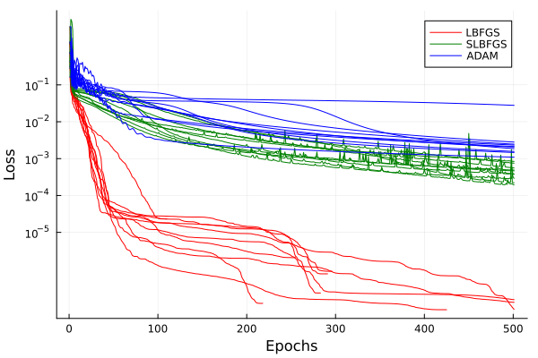

[](https://travis-ci.org/baggepinnen/FluxOptTools.jl)
[](https://codecov.io/gh/baggepinnen/FluxOptTools.jl)

# FluxOptTools
This package contains some utilities to enhance training of [Flux.jl](https://github.com/FluxML/Flux.jl) models.
## Train using Optim
[Optim.jl](https://github.com/JuliaNLSolvers/Optim.jl) can be used to train Flux models (if Flux is on branch `sf/zygote_updated`), here's an example how
```julia
using Flux, Zygote, Optim, FluxOptTools
m = Chain(Dense(1,3,tanh) , Dense(3,1))
x = LinRange(-pi,pi,100)'
y = sin.(x)
loss() = mean(abs2, m(x) .- y)
Zygote.refresh()
pars = Flux.params(m)
lossfun, gradfun, fg!, p0 = optfuns(loss, pars)
res = Optim.optimize(Optim.only_fg!(fg!), p0, Optim.Options(iterations=1000, store_trace=true))
```
The utility provided by this package is the function `optfuns` which returns three functions and a vectorized version of `pars`. L-BFGS typically has better convergence properties than, e.g., the ADAM optimizer. Here's a benchmark where L-BFGS in red beats ADAM with tuned step size in blue.


The code for this benchmark is in the `runtests.jl`.

## Visualize loss landscape
We define a plot recipe such that a loss landscape can be plotted with
```julia
using Plots
plot(loss, pars, l=0.1, npoints=50, seriestype=:contour)
```

The landscape is plotted by selecting two random directions and extending the current point (`pars`) a distance `l*norm(pars)` (both negative and positive) along the two random directions. The number of loss evaluations will be `npoints^2`.
