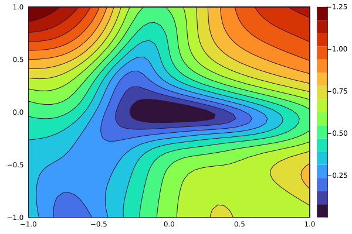

[](https://github.com/baggepinnen/FluxOptTools.jl/actions)
[](https://codecov.io/gh/baggepinnen/FluxOptTools.jl)

# FluxOptTools
This package contains some utilities to enhance training of [Flux.jl](https://github.com/FluxML/Flux.jl) models.
## Train using Optim
[Optim.jl](https://github.com/JuliaNLSolvers/Optim.jl) can be used to train Flux models (if Flux is on version 0.10 or above), here's an example how
```julia
using Flux, Zygote, Optim, FluxOptTools, Statistics
m      = Chain(Dense(1,3,tanh) , Dense(3,1))
x      = LinRange(-pi,pi,100)'
y      = sin.(x)
loss() = mean(abs2, m(x) .- y)
Zygote.refresh()
pars   = Flux.params(m)
lossfun, gradfun, fg!, p0 = optfuns(loss, pars)
res = Optim.optimize(Optim.only_fg!(fg!), p0, Optim.Options(iterations=1000, store_trace=true))
```
The utility provided by this package is the function `optfuns` which returns three functions and `p0`, a vectorized version of `pars`. BFGS typically has better convergence properties than, e.g., the ADAM optimizer. Here's a benchmark where BFGS in red beats ADAGrad with tuned step size in blue, and a [stochastic L-BFGS [1]](https://arxiv.org/abs/1802.04310) ([implemented](https://github.com/baggepinnen/FluxOptTools.jl/blob/master/src/SLBFGS.jl) in this repository) in green performs somewhere in between.


The code for this benchmark is in the `runtests.jl`.

## Visualize loss landscape
We define a plot recipe such that a loss landscape can be plotted with
```julia
using Plots
plot(loss, pars, l=0.1, npoints=50, seriestype=:contour)
```


The landscape is plotted by selecting two random directions and extending the current point (`pars`) a distance `l*norm(pars)` (both negative and positive) along the two random directions. The number of loss evaluations will be `npoints^2`.


## Flatten and Unflatten
What this package really does is flattening and reassembling the types `Flux.Params` and `Zygote.Grads` to and from vectors. These functions are used like so
```julia
p = zeros(pars)  # Creates a vector of length sum(length, pars)
copyto!(p,pars)  # Store pars in vector p
copyto!(pars,p)  # Reverse

g = zeros(grads) # Creates a vector of length sum(length, grads)
copyto!(g,grads) # Store grads in vector g
copyto!(grads,g) # Reverse
```
This is what is used under the hood in the functions returned from `optfuns` in order to have everything on a form that Optim understands.


# References
[[1] "Stochastic quasi-Newton with adaptive step lengths for large-scale problems", Adrian Wills, Thomas Schön, 2018](https://arxiv.org/abs/1802.04310)
